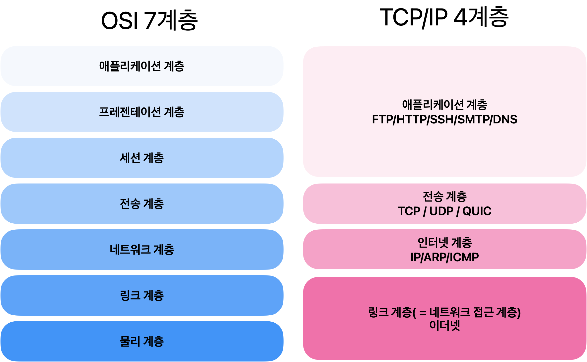
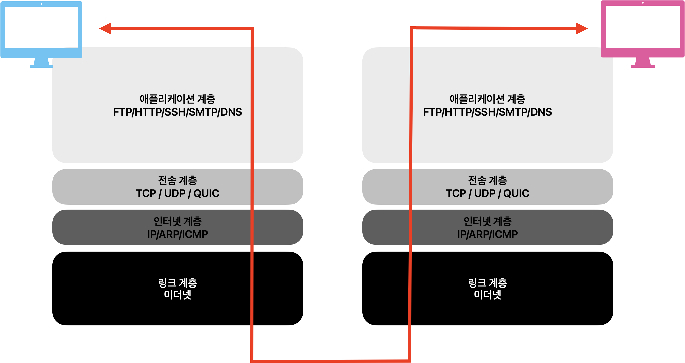
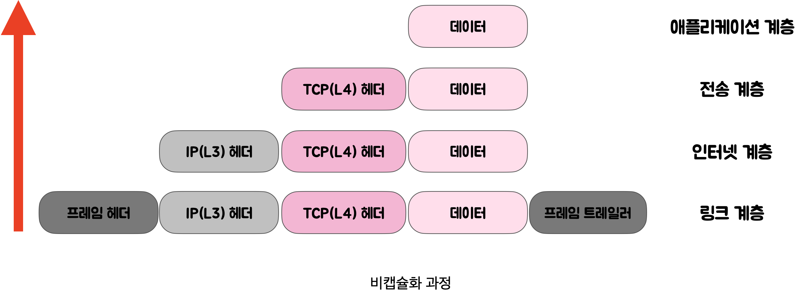

# HTTP란?
<!-- more -->

### ✏️ [www.google.com](http://www.google.com/) 을 주소창에 쳤을 때 화면이 나오기까지의 과정
> (필수 키워드) DNS, TCP, IP, HTTP 프로토콜  
> (추천) 캐시, 로드밸런서, L4, L7  
  
1. 사용자가 브라우저에 URL([www.google.com](http://www.google.com/) )를 입력한다. <span style="background-color:#fff5b1"> HTTP request message </span> 를 생성한다.
2. IP 주소를 알아야 전송을 할 수 있으므로, DNS lookup을 통해 해당 domain의 server의 IP주소를 알아낸다.
3. 반환된 IP 주소(google의 server IP)로 HTTP 요청 메시지(request message) 전송 요청한다.
    - 생성된  HTTP 요청 메시지(request message)를 TCP/IP층에 전달한다. 
    - HTTP 요청 메시지에 헤더(TCP + IP)를 추가해서 TCP/IP패킷을 생성한다.
4. 패킷은 전기신호로 랜선을 통해 네트워크로 전송되고, 목적하는 google 서버에  전기적인 신호로 도달한다.
5. google 서버에 도착한 패킷은 encapsulation ↔ decapsulation를 통해 메시지를 복원하고(http 데이터만 남게 된다), 서버의 어플리케이션(tomcat 등)으로 보낸다.
6. 서버 어플리케이션은 요청 메시지에 대한 response data를 가지고 HTTP응답 메시지( response message)를 생성한다.
7. HTTP 응답 메시지를 전달 받은 방식 그대로 client IP로 전송한다.
8. HTTP response message에 담긴 데이터를 토대로 웹브라우저에서  HTML 렌더링을 하여 모니터에 google화면 보여진다.
---



### 📌 DNS(Domain Name System)
인터넷의 전화번호부!  
사용자가 google.com과 같은 도메인 이름을 웹 브라우저에 입력하는 경우 DNS는 해당 사이트의 IP주소를 찾아주는 역할을 한다.  
웹사이트에 접속 할 때 우리는 외우기 어려운 IP 주소 대신 도메인 이름을 사용한다. 도메인 이름을 사용했을 때 입력한 도메인을 실제 네트워크상에서 사용하는 IP 주소로 바꾸고 해당 IP 주소로 접속하는 과정이 필요하다. 이러한 과정을 DNS라고 한다.  

DNS 구성요소 3가지는 다음과 같다.
### 1. **도메인 네임 스페이스**(Domain Name Space)
- 정해진 규칙에 따라 도메인 이름을 계층적 구조로 저장하는 것이다.  
- 하위 조직의 네임 스페이스를 할당하고 관리하는 방식은 각 하위 기관의 관리 책임자에게 위임된다.
    - 예를 들어, hyewon.com 도메인은 com 도메인을 관리하는 네임 서버에 등록되어 있고 www.hyewon.com은 hyewon.com을 관리하는 네임서버에 등록되어 관리된다.  
  

### 2. 네임 서버(DNS Server , Name Server)
    
- 문자열로 표현된 도메인 이름을 실제 컴퓨터가 통신할 때 사용하는 IP주소로 변환시키기 위해 수 많은  IP주소의 도메인 정보를 가지고 있는 곳이다.  
- 전세계에 13개의 Root DNS 서버가 구축되어 있다. 그리고 DNS 서버를 복사하여 같은 기능을 담당하는 미러 서버가 있다고 한다.
    
### 3. 리졸버(Resolver)
    
- DNS 클라이언트 요청을 네임 서버로 전달하고 찾은 정보를 클라이언트에게 제공하는 기능을 수행한다. 즉 어떤 서버에서 찾아야 하는지, 이미 캐싱되어있는지 등을 찾아서 클라이언트에게 전달하는 역할을 수행한다.
    - kt, LG유플러스, SK 브로드밴드 등

---

### 📌 계층 간 데이터 송수신 과정
  
사용자가 컴퓨터를 통해 다른 컴퓨터로 데이터를 요청한다면?   
애플리케이션 계층에서 전송 계층으로 사용자가 보내는 요청 값들이 캡슐화 과정을 통해 전달된다. 그리고 다시 링크 계층을 통해 해당 서버와 통신하고, 서버의 링크계층으로 부터 애플리케이션까지 비캡슐화 과정을 거쳐 데이터가 전송된다.


---
### 📌 캡슐화(encapsulation) ↔ 비캡슐화(decapsulation)
**1️⃣ 캡슐화**  

  
캡슐화 과정은 상위 계층의 헤더와 데이터를 하위 계층의 데이터 부분에 포함시키고 해당 계층의 헤더를 삽입 하는 과정이다.  

1. 애플리케이션 계층 데이터 -> 전송 계층  
    - '세그먼트' or '데이터그램'화 되며 TCP(L4)화 된다.  
2. 전송 계층 -> 인터넷 계층  
    - IP(L3) 헤더가 붙여지며 '패킷'화 된다.  
3. 인터넷 계층 -> 링크 계층  
    - 프레임 헤더와 프레임 트레일러가 붙어 '프레임'화 된다.  


---
**2️⃣ 비캡슐화**  

  
비캡슐화 과정은 하위 계층에서 상위 계층으로 가며 각 계층의 헤더 부분을 제거하는 과정이다.
캡슐화된 데이터를 받게 되면 링크 계층에서부터 올라오면서 프레임화된 데이터는 다시 패킷화를 거쳐 세그먼트, 데이터그램화를 거쳐 메시지화가 되는 비캡슐화 과정이 일어난다.   
최종적으로 애플리케이션에게 데이터를 전달하게 된다!

---


### 애플리케이션 계층을 처리하는 기기 (L7, L4)
로드밸런서란 여러대의 서버에 부하를 분산하는 기기로 클라이언트로 부터 들어오는 요청들을 뒤쪽의 여러 서버로 나눠줍니다.

### **L4 로드 밸런서**
- **전송 계층(Transport Layer, Layer 4)** 에서 작동하는 로드 밸런서이다.
- 주로 TCP 및 UDP 프로토콜을 기반으로 클라이언트와 서버 간의 트래픽을 분산시킨다.
- 클라이언트의 IP 주소와 포트, 서버의 IP 주소와 포트를 기반으로 로드 밸런싱을 수행한다.
- NLB(Network Load Balance)

### **L7 로드 밸런서**

- **애플리케이션 계층(Application Layer, Layer 7)** 에서 작동하는 로드 밸런서이다.
- 주로 HTTP 및 HTTPS 프로토콜을 기반으로 클라이언트와 서버 간의 트래픽을 분산시킨다.
- 요청 내용(URL, 캐시, 헤더, 쿠키 등)을 기반으로 트래픽을 분산한다.
- 만약 장애가 발생한 서버가 있다면 이를 트래픽 분산 대상에서 제외 해야 하는데, health check를 통해 이루어진다.
    - 서버에게 "잘 살아있니?" "네!" -> 대략 30초 마다 한번씩 체크한다.
- ALB (Application Load Balance)

| 항목 | L4 로드 밸런서 | L7 로드 밸런서 |
|------|---------------|---------------|
| 작동 계층 | 전송 계층(Layer 4) | 애플리케이션 계층(Layer 7) |
| 주요 프로토콜 | TCP, UDP | HTTP, HTTPS |
| 로드 밸런싱 기준 | IP 주소, 포트 | 요청 내용(URL, 헤더, 쿠키 등) |
| 처리 속도 | 상대적으로 빠름 | 상대적으로 느림 |
| 기능 및 유연성 | 상대적으로 제한적 | 다양한 기능 및 유연성 |


## HTTP란?  
웹 브라우저와 웹 서버가 통신을 할 때 사용하는 통신규칙  
HTTP는 서버와 클라이언트 간에 데이터가 교환되는 방식이다. Request는 클라이언트가 서버로 전달하는 메시지이고, Response는 Request에 대한 서버의 답변이다.

### 1. HTTP request
HTTP request 메세지는 크게 3부분으로 구성된다:

- start line
- header
- message body

  
### 1-1. Start Line

말 그대로 HTTP request의 첫 라인으로 HTTP 메소드, Request target, HTTP version이 있다.

- **HTTP 메소드**: 요청의 의도를 담고 있는 GET, POST, PUT, DELETE 등이 있다.
- **Request target**: HTTP Request가 전송되는 목표 주소입니다.
- **HTTP version**: version에 따라 Request 메시지 구조나 데이터가 다를 수 있어서 version을 명시한다.

### 1-2. Header

해당 request에 대한 추가 정보(addtional information)를 담고 있는 부분이다.
```
Key:Value 형태
```

자주 사용되는 header 정보

- **Host** : 요청한 서버의 도메인명 또는 IP 주소
- **User-Agent**: 요청을 보내는 클라이언트의 웹브라우저에 대한 정보.
- **Referer** : 바로 직전에 머물렀던 웹 링크 주소
- **Accept**: 클라이언트가 받을 수 있는 응답(response) 타입.
- **Connection**: 해당 요청이 끝난후에 클라이언트와 서버가 계속해서 네트워크 컨넥션을 유지 할것인지 아니면 끊을것인지에 대해 지시하는 부분.
- **Content-Type**: 해당 요청이 보내는 메세지 body의 타입. 예를 들어, JSON을 보내면 application/json.
- **Content-Length**:메세지 body의 길이.
- **Authorization**: 인증 토큰 정보 등

### 1-3. Body

POST, PUT 요청과 같이 **요청과 함께 전달되는 데이터** 를 포함한다. 요청과 함께 전달되는 데이터가 없을 경우 Body가 없을 수도 있다. GET request들은 url에 정보를 담아서 body가 없는 경우가 많고, POST 요청일 경우, body에 데이터를 담아간다.

---


### 2. HTTP Response
Response도 request와 마찬가지로 크게 3부분으로 구성되어 있다.  

- Status line  
- Headers  
- Body      

  

### 2-1. Status Line

Response의 상태를 간략하게 나타내주며 3부분으로 구성되어 있다.

- HTTP Version
- Status code: 응답 상태를 나타내는 코드이다. (예를 들어, 200, 404 등)
- Status text: 응답 상태를 간략하게 설명해주는 부분.예를 들어, "Not Found"
```
HTTP/1.1 404 Not Found
``` 
    

### 2-2. Headers

Request의 headers와 동일 하지만 response에서만 사용되는 header 값들이 있다. 예를 들어, User-Agent 대신에 Server 헤더가 사용된다.  

- **Location** : 301, 302 상태코드일 때만 볼 수 있는 Header로 서버의 응답이 다른 곳에 있다고 알려주면서 해당 위치(URI)를 지정한다.
- **Status Code**: 응답 상태 코드 (200, 404, 500 등)  
- **Server** : 웹 서버의 종류    
- **Age** : max-age 시간내에서 얼마나 흘렀는지 초 단위로 알려주는 값     
- **Referrer-policy** : 서버 referrer 정책을 알려주는 값 ex) origin, no-referrer, unsafe-url  
- **WWW-Authenticate** : 사용자 인증이 필요한 자원을 요구할 시 , 서버가 제공하는 인증 방식  
- **Proxy-Authenticate** : 요청한 서버가 프록시 서버인 경우 유저 인증을 위한 값  
    

### 2-3. Body
Response의 body와 일반적으로 동일하다. Request와 마찬가지로 모든 response가 body가 있지는 않다. 응답할 데이터가 없을 경우 body가 비어있게 된다.


---
## HTTP와 HTTPS 차이점
HTTP는 암호화가 되지 않은 평문 데이터를 전송하는 프로토콜이였기 때문에, HTTP로 비밀번호나 주민등록번호 등을 주고 받으면 제3자가 정보를 조회(스니핑)할 수 있었다. 이러한 문제를 해결하기 위해 HTTPS가 등장하게 되었다.  

HTTPS를 사용하는 2가지 이유  

1. 내가 사이트에 보내는 정보(id, pw)들을 제 3자가 보지 못하도록 암호화 한다.
    - 대칭키 / 비대칭키 (공부해보기)
    - 암호 가능한 키를 클라이언트한테 주기 + 해독 가능한 키는 google서버만 갖고 있고 (완전 비밀)
2. 접속한 사이트가 믿을만한 곳인지를 알려준다.
    - HTTPS를 사용하는 웹사이트는 신뢰할 수 있는 기관(인증 기관, CA)으로부터 SSL/TLS 인증서를 받게 되며 인증서를 가지고 있지 않은 브라우저는 경고를 표시를 해준다.  
